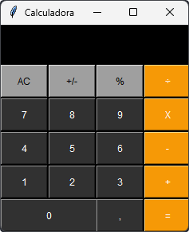

# Calculadora em Python

> Calculadora simples de Python com interface. Feita com a ferramenta tkinter.

## 💻 Pré-requisitos

Antes de começar, verifique se você atendeu aos seguintes requisitos:

* Você instalou a versão mais recente do `Python`
